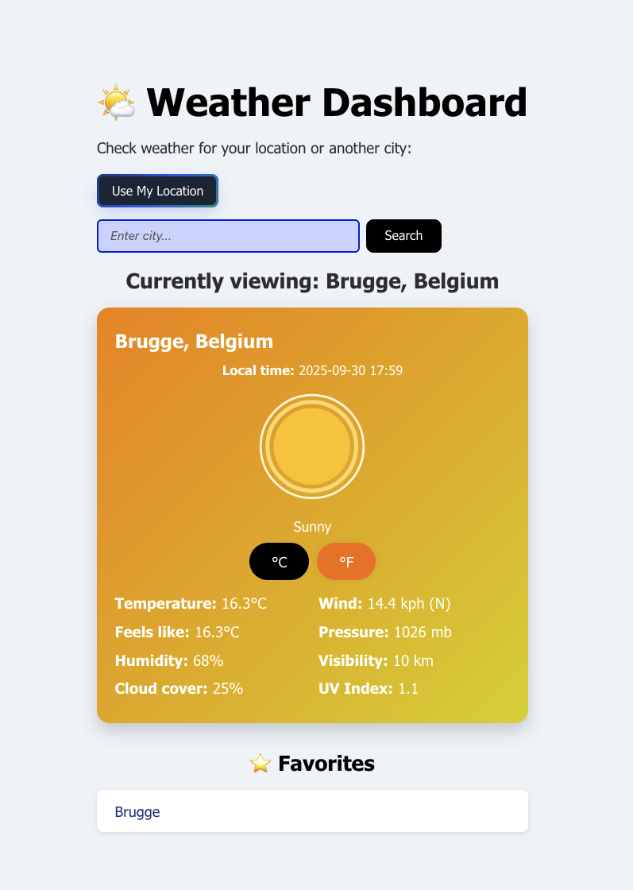
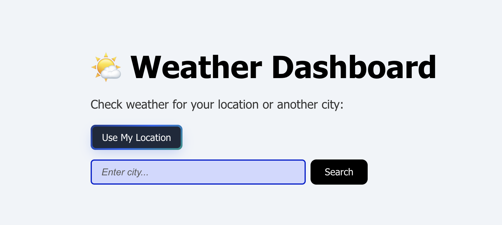
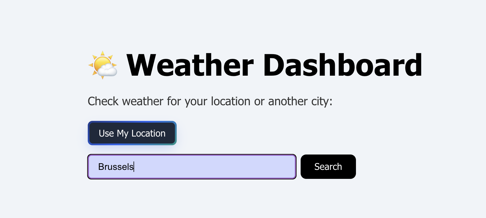
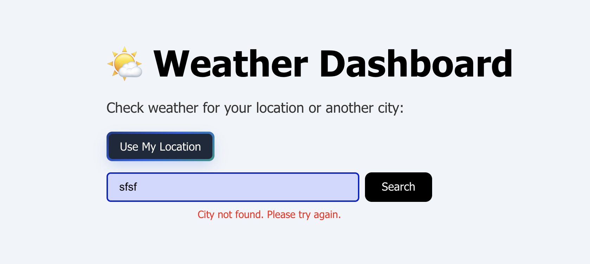
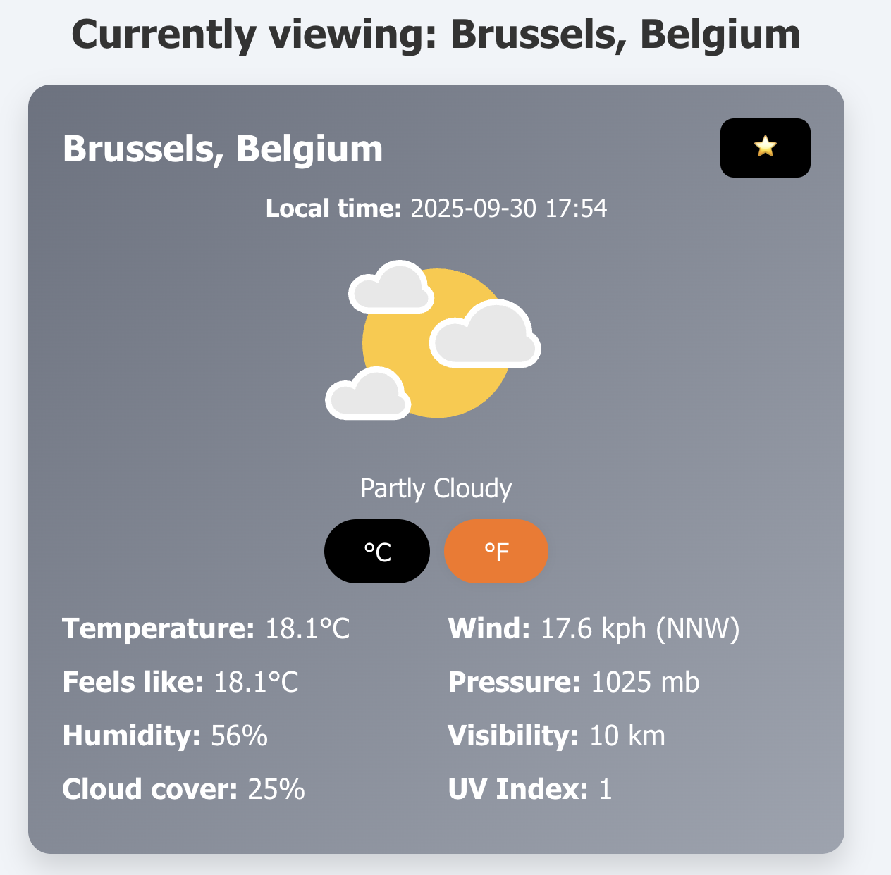
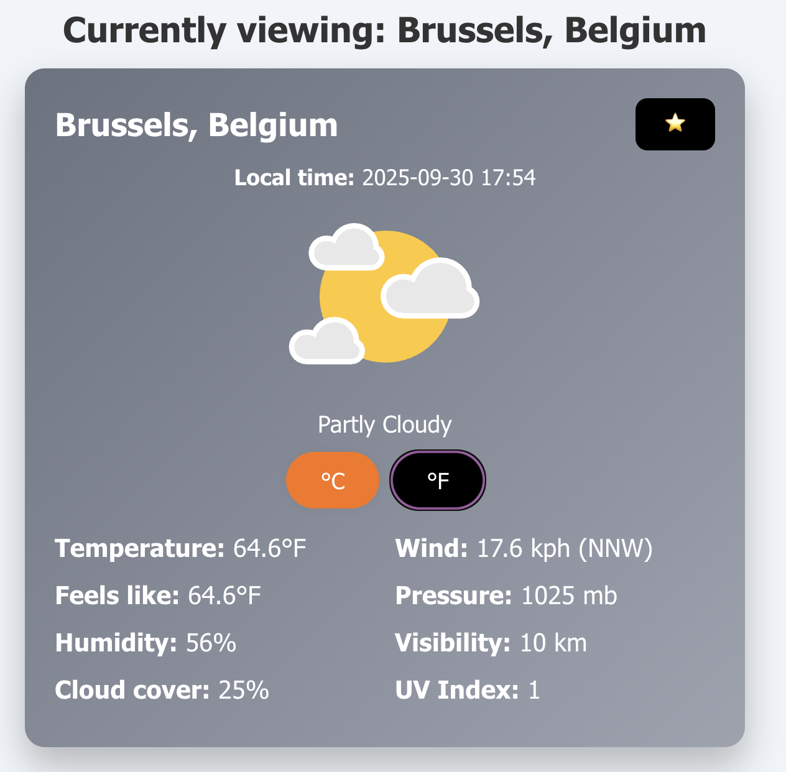
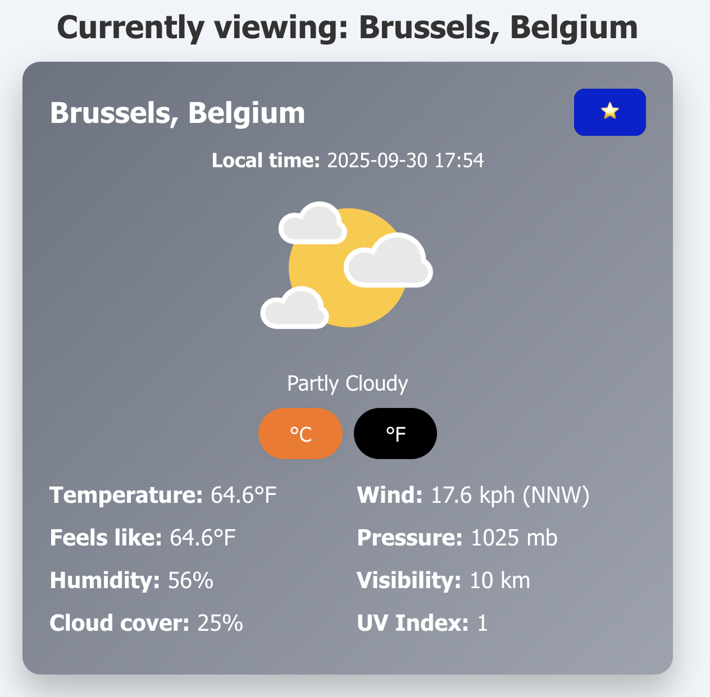
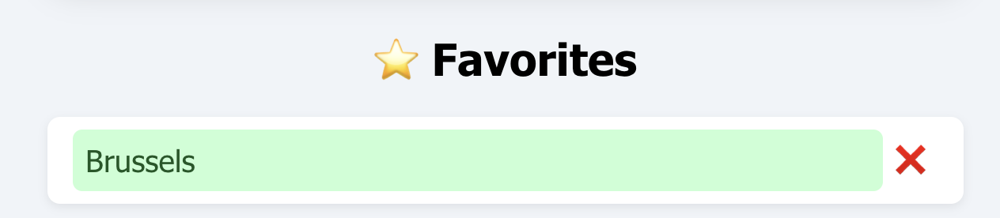
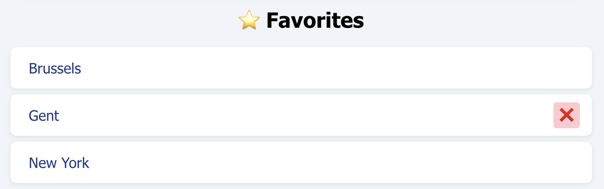

# 🌤 Weather Dashboard  

A simple weather application built with **React** (frontend) and **Node.js** (backend).  
This project was created as part of an internship test for **DEV@WORK** to demonstrate knowledge in full-stack software development.  

## Features  

- Search weather by **city name** 
- Fetch weather using **your current location** (Geolocation API)  
- Display key weather information (temperature, conditions, etc.)  
- Toggle between **Celsius ↔ Fahrenheit**  
- Add/remove favorite cities  
- Persistent favorites stored in **localStorage**  
- Clean dashboard UI  

---

## Tech Stack  

- **Frontend:** React + Vite + TypeScript  
- **Backend:** Node.js  
- **API:** https://www.weatherapi.com

---

## Installation & Setup  

### 1. Clone the Repository  
```bash
git clone https://github.com/Mrpotato-pro/Weather_app.git
cd <your-repo-name>
```

### 2. Backend Setup
```bash
cd back-end
npm install
npm run dev
```
The backend will start at http://localhost:4000 (update if different).

#### Create a .env file in your backend directory:
```env
NODE_ENV=development

WEATHER_API_KEY=f75a3c72fcf84d7183785659252909
```

### 3. Frontend Setup
```bash
cd front-end
npm install
npm run dev
```
The frontend will start at http://localhost:5173 (or whichever port Vite selects).

#### Create a .env file in your frontend directory:
```env
VITE_API_URL='http://localhost:4000/weather'
```

## Screenshots

### Dashboard View  
This is the main dashboard showing the current weather for the selected city.  



---

### Search Bar  
You can search for weather by entering a city name or by using the **Use My Location** button, which will give you the weather status of your current location.  

  

Typing in the city name:  

  

If the city name doesn't exist, the field is empty, or the input isn't valid, an error is displayed:  

  

---

### Weather Card  
The weather card displays temperature, condition, and location details.  

  

Switch from Celsius to Fahrenheit using the toggle button:  

  

Use the favorites button to add a city to your favorites list:  

  

---

### Favorites  
You can save cities to your favorites and quickly switch between them.  
There is also an option to delete a city from your list.  

  

  


## 🎥 Demo

[Download Demo Video](./images/demo.mov)